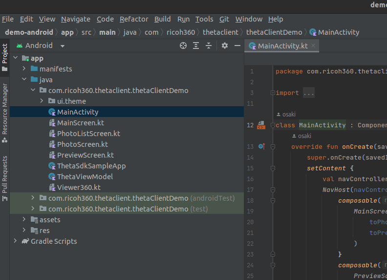
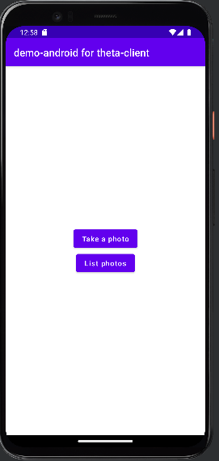
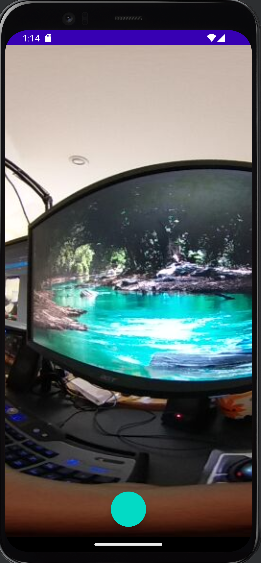

# Running demo-android

Native Android kotlin build.

## build theta-client

1. clone theta-client repo from
[https://github.com/ricohapi/theta-client.git](https://github.com/ricohapi/theta-client.git)
1. cd into theta-client
1. build theta-client aar

```text
git clone https://github.com/ricohapi/theta-client.git
cd theta-client
./gradlew publishToMavenLocal

Starting a Gradle Daemon (subsequent builds will be faster)
<--
...
...

BUILD SUCCESSFUL in 31s
59 actionable tasks: 59 executed
```

## build demo-android

Open `demos/demo-android` in Android Studio.

I'm using Electric Eel for this test.

<figure markdown>

<figcaption>demo-android in Android Studio Electric Eel</figcaption>
</figure>

Press run in Android Studio.

<figure markdown>

<figcaption>Press run to build and install</figcaption>
</figure>

When the build is successful, it will appear in the Android Virtual Devices (AVD).

<figure markdown>

<figcaption>Running in Pixel 4 AVD</figcaption>
</figure>

## Take Pictures

Connect your workstation to the RICOH THETA camera.
The password is the numerical digits of the serial number.

<figure markdown>

<figcaption>Connect workstation to RICOH THETA as hotspot</figcaption>
</figure>

Press take picture to see a live preview.

<figure markdown>

<figcaption>live preview shown prior to taking picture</figcaption>
</figure>

take picture
