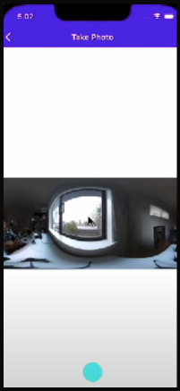

# React Native RICOH THETA Demo Installation Guide for Windows

## Overview

Guide covers the installation process of React Native on **Windows OS** so that we can run the `demo-react-native`. 
Another section will cover the installation for Mac OS. For this installation you will need to install **node.js** if you haven't already. 
Their will be videos and links in the resource section for the installation of node.js on your computer. Article also covers how to build the `theta-client` and make it available to `demo-react-native`. 
As well as building the `demo-react-native` and running it on an android emulator. 
My results will be shown in the article with the **THETA X** running the react native demo app provided by the RICOH API.

## General Steps to run React Native Demo on Windows

1. Build the `theta-client` and make it available to `demo-react-native`
2. Build `demo-react-native`
3. Test the `demo-react-native` build on **THETA X** with an emulator
    
4. Test all demo features : List Files, Take Photo

Resources

* [GITHUB React Native demo for theta-client](https://github.com/ricohapi/theta-client/tree/main/demos/demo-react-native)

* [VIDEO theta-client React Native full build tutorial and demonstration](https://www.youtube.com/watch?v=SqzDomDikcM)

* [VIDEO HowTo Install nvm, node, npm and yarn on Windows 11](https://www.youtube.com/watch?v=NWUfaXFPv50)

## Work Environment

| Dell XPS 13 | Details                              |
| ----------- | ------------------------------------ |
| CPU         | Intel(R) Core(TM) i7-10710U CPU @ 1.10GHz   1.61 GHz  |
| RAM         | 16.0 GB |
| OS          | Windows 11 Home |

## Install react native toolchain

## Install and build theta-client

## Install and build demo-react-native

## Test Results on THETA X

## Summary and Next Steps